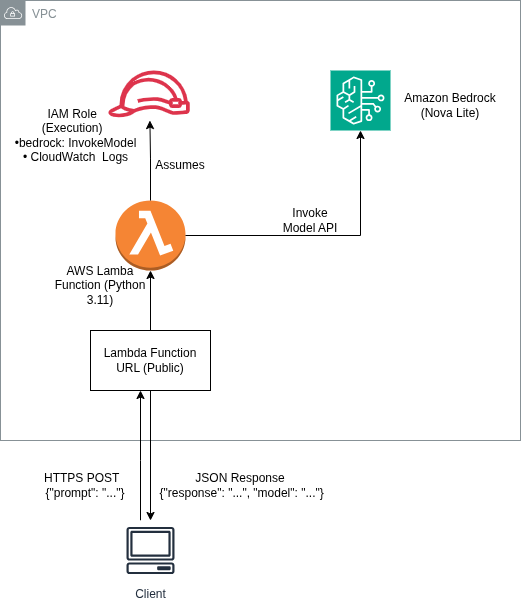
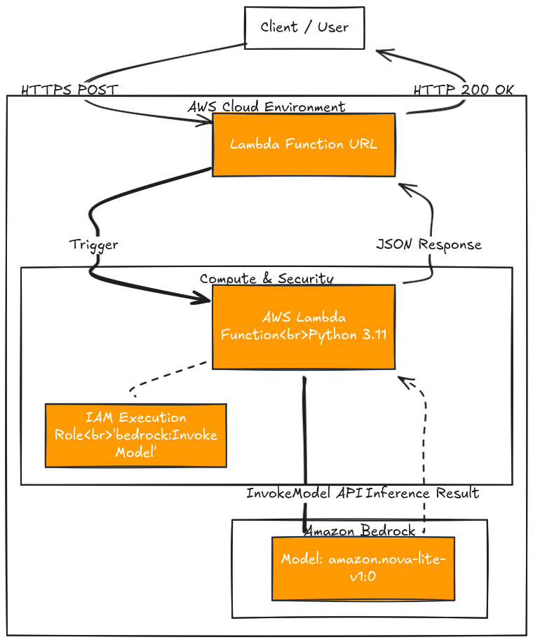
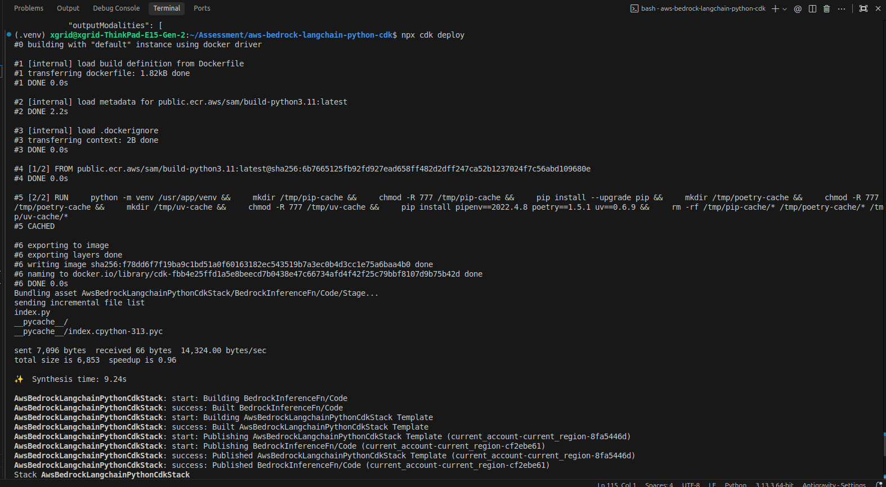
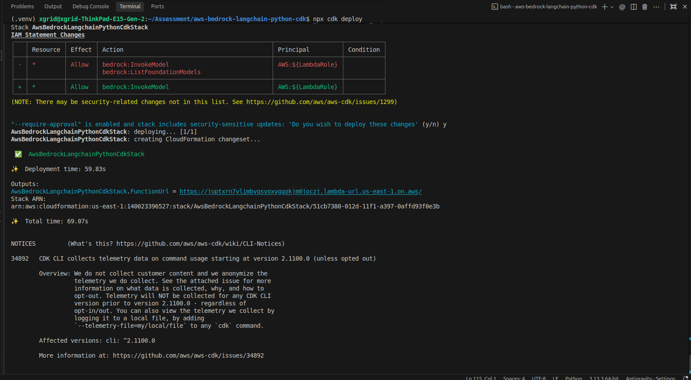
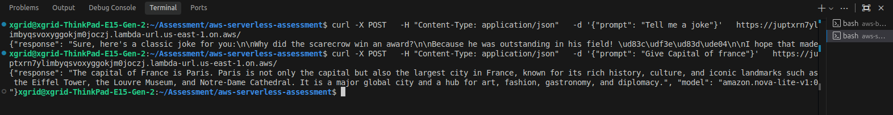
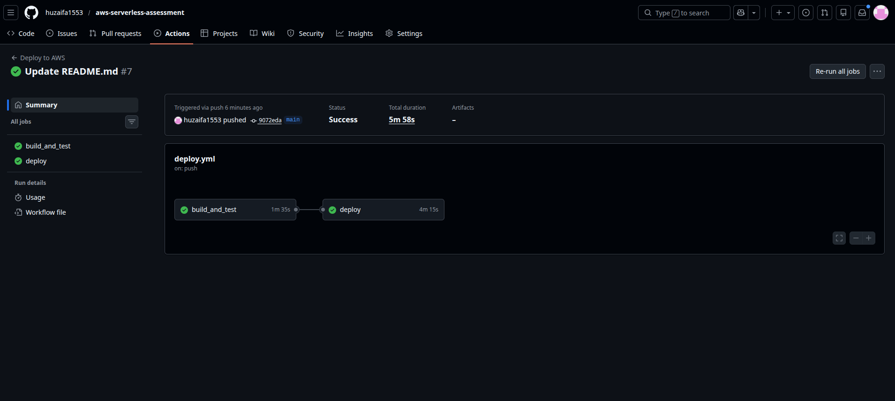
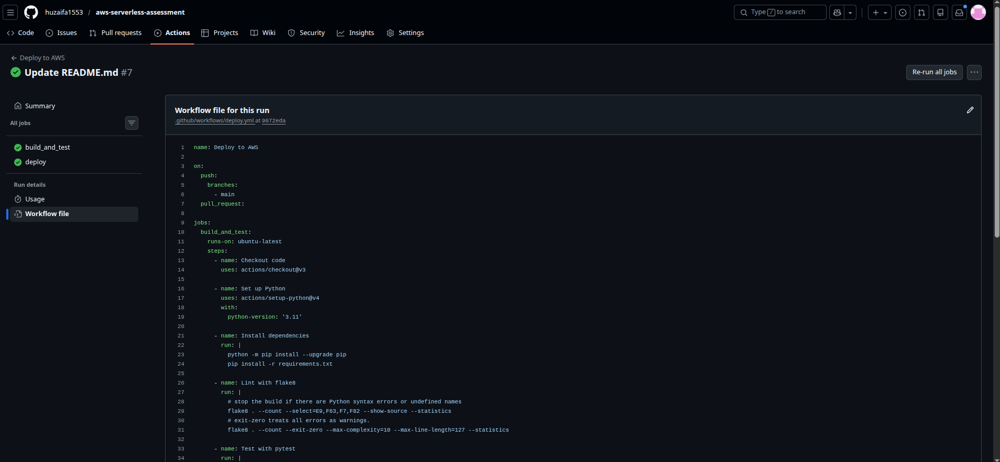
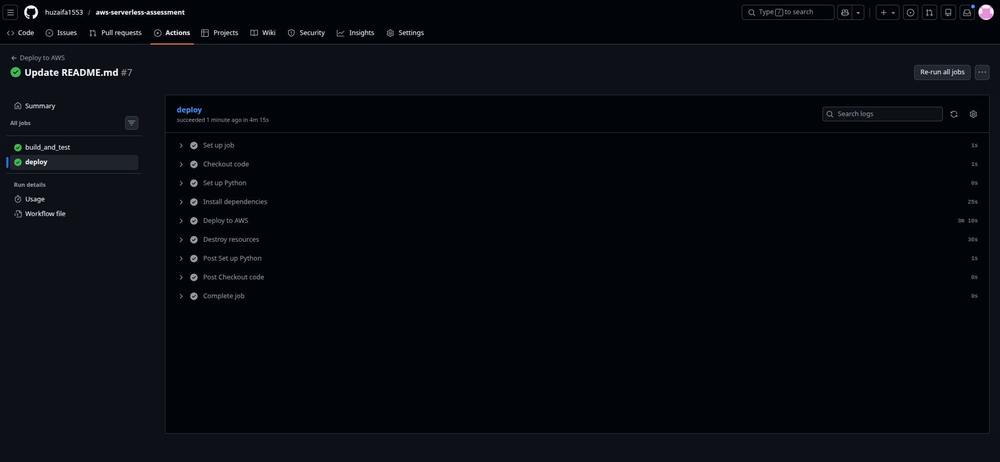
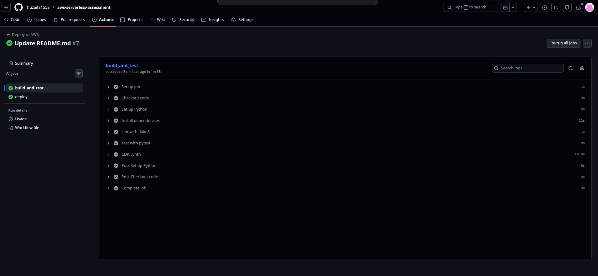

# Serverless Bedrock API

A minimal serverless API on AWS to perform LLM inference using Amazon Bedrock.

## Model Choice
*   **Primary**: `amazon.nova-lite-v1:0`
*   **Why**: 
    *   **Cost-Effective**: Significantly cheaper than Titan Express or Claude.
    *   **Performance**: Low latency, ideal for serverless timeouts.
    *   **Modern API**: Uses the `Converse` style (Messages API) structure.

## IAM Permissions
*   **Lambda Execution Role**:
    *   `bedrock:InvokeModel`: Grants access to run inference.
    *   `AWSLambdaBasicExecutionRole`: Grants permissions for CloudWatch Logs.
*   **Best Practice**: In production, restrict `Resource` to specific Model ARNs (e.g., `arn:aws:bedrock:us-east-1::foundation-model/amazon.nova-lite-v1:0`).

## Cost Considerations
*   **AWS Lambda**:
    *   **Free Tier**: 400,000 GB-seconds/month.
    *   **Configuration**: 512MB RAM (low cost), running for only a few seconds per request.
*   **Function URL**: Included with Lambda at no extra cost (unlike API Gateway).
*   **Amazon Bedrock**: Pay-per-token pricing (Input/Output). Nova Lite is highly economical for high-volume text tasks.

## Possible Improvements
1.  **Authentication**: Add `AWS_IAM` auth to the Function URL or put behind API Gateway with an Authorizer.
2.  **Streaming**: Implement response streaming (Lambda supports response streaming) for better user experience.
3.  **Strict IAM**: Scope down IAM policy from `*` to exact Model ARNs.
4.  **WAF**: Attach AWS WAF to the Function URL (via CloudFront) for DDoS protection.

## Deployment

### Local Deployment
To deploy this project from your local machine, ensure you have the [AWS CLI](https://aws.amazon.com/cli/) and [AWS CDK](https://docs.aws.amazon.com/cdk/v2/guide/getting_started.html) installed and configured.

1.  **Clone the repository**:
    ```bash
    git clone https://github.com/huzaifa1553/aws-serverless-assessment.git
    cd aws-serverless-assessment
    ```
2.  **Create and activate a virtual environment**:
    ```bash
    python3 -m venv .venv
    source .venv/bin/activate
    ```
3.  **Install dependencies**:
    ```bash
    pip install -r requirements.txt
    ```
4.  **Bootstrap AWS environment** (if not done previously):
    ```bash
    cdk bootstrap
    ```
5.  **Deploy**:
    ```bash
    cdk deploy
    ```
    This will output the Function URL upon success.

### GitHub Actions (CI/CD)
The project includes a GitHub Actions pipeline (`.github/workflows/deploy.yml`) that automates deployment.

1.  **Triggers**: The pipeline triggers on push to the `main` branch.
2.  **Secrets**: You must configure the following **GitHub Secrets**:
    *   `AWS_ACCESS_KEY_ID`
    *   `AWS_SECRET_ACCESS_KEY`
    *   `AWS_REGION` (e.g., `us-east-1`)
    *   `AWS_SESSION_TOKEN` (if using temporary credentials)
3.  **Workflow**:
    *   **Build & Test**: Installs dependencies, runs `flake8` linting, and executes `pytest` unit tests.
    *   **Deploy**: Runs `cdk bootstrap` and `cdk deploy`.
    *   **Cleanup**: Runs `cdk destroy` immediately after deployment (configured for testing purposes). *Note: Uncomment the deploy job in `.github/workflows/deploy.yml` and remove the destroy step to keep the API running.*

## Architecture



## Workflow Diagram



## Screenshots







