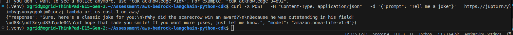
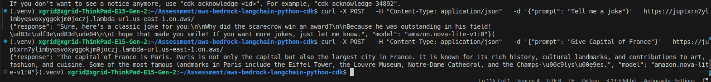

# Serverless Bedrock API

A minimal serverless API on AWS to perform LLM inference using Amazon Bedrock.

## Model Choice
*   **Primary**: `amazon.nova-lite-v1:0`
*   **Why**: 
    *   **Cost-Effective**: Significantly cheaper than Titan Express or Claude.
    *   **Performance**: Low latency, ideal for serverless timeouts.
    *   **Modern API**: Uses the `Converse` style (Messages API) structure.

## IAM Permissions
*   **Lambda Execution Role**:
    *   `bedrock:InvokeModel`: Grants access to run inference.
    *   `AWSLambdaBasicExecutionRole`: Grants permissions for CloudWatch Logs.
*   **Best Practice**: In production, restrict `Resource` to specific Model ARNs (e.g., `arn:aws:bedrock:us-east-1::foundation-model/amazon.nova-lite-v1:0`).

## Cost Considerations
*   **AWS Lambda**:
    *   **Free Tier**: 400,000 GB-seconds/month.
    *   **Configuration**: 512MB RAM (low cost), running for only a few seconds per request.
*   **Function URL**: Included with Lambda at no extra cost (unlike API Gateway).
*   **Amazon Bedrock**: Pay-per-token pricing (Input/Output). Nova Lite is highly economical for high-volume text tasks.

## Possible Improvements
1.  **Authentication**: Add `AWS_IAM` auth to the Function URL or put behind API Gateway with an Authorizer.
2.  **Streaming**: Implement response streaming (Lambda supports response streaming) for better user experience.
3.  **Strict IAM**: Scope down IAM policy from `*` to exact Model ARNs.
4.  **WAF**: Attach AWS WAF to the Function URL (via CloudFront) for DDoS protection.

## Architecture

## Screenshots

